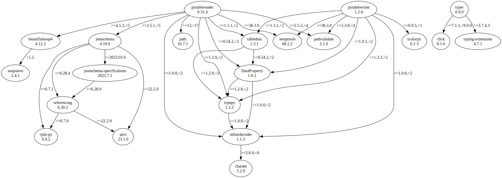

# Third Party Dependencies

<!--[[[fill sbom_sha256()]]]-->
The [SBOM in CycloneDX v1.4 JSON format](https://github.com/sthagen/pilli/blob/default/sbom.json) with SHA256 checksum ([2377ad4c ...](https://raw.githubusercontent.com/sthagen/pilli/default/sbom.json.sha256 "sha256:2377ad4c5963a459b3958bb90422decbfd2e310bc9e52c63a02bde4741a7f1e8")).
<!--[[[end]]] (checksum: b9564de84bd65c21c0b870f16502b143)-->
## Licenses 

JSON files with complete license info of: [direct dependencies](direct-dependency-licenses.json) | [all dependencies](all-dependency-licenses.json)

### Direct Dependencies

<!--[[[fill direct_dependencies_table()]]]-->
| Name                                                      | Version                                                        | License     | Author                             | Description (from packaging data)                                                                                                     |
|:----------------------------------------------------------|:---------------------------------------------------------------|:------------|:-----------------------------------|:--------------------------------------------------------------------------------------------------------------------------------------|
| [puhdistusalue](https://git.sr.ht/~sthagen/puhdistusalue) | [2022.7.24](https://pypi.org/project/puhdistusalue/2022.7.24/) | MIT License | Stefan Hagen                       | Puhdistusalue (Finnish for clean area here meaning purge range) - Purge monotonically named files in folders keeping range endpoints. |
| [puristaa](https://git.sr.ht/~sthagen/puristaa)           | [2022.7.24](https://pypi.org/project/puristaa/2022.7.24/)      | MIT License | Stefan Hagen                       | Puristaa (Finnish for compress) - shared prefix compression of ordered string sequences.                                              |
| [scooby](https://github.com/banesullivan/scooby)          | [0.6.0](https://pypi.org/project/scooby/0.6.0/)                | MIT License | Dieter Werthmüller & Bane Sullivan | A Great Dane turned Python environment detective                                                                                      |
| [typer](https://github.com/tiangolo/typer)                | [0.6.1](https://pypi.org/project/typer/0.6.1/)                 | MIT License | Sebastián Ramírez                  | Typer, build great CLIs. Easy to code. Based on Python type hints.                                                                    |
<!--[[[end]]] (checksum: e3fa4d12a4b864cccdc627f9f39676ef)-->

### Indirect Dependencies

<!--[[[fill indirect_dependencies_table()]]]-->
| Name                                          | Version                                        | License     | Author         | Description (from packaging data)         |
|:----------------------------------------------|:-----------------------------------------------|:------------|:---------------|:------------------------------------------|
| [click](https://palletsprojects.com/p/click/) | [8.1.3](https://pypi.org/project/click/8.1.3/) | BSD License | Armin Ronacher | Composable command line interface toolkit |
<!--[[[end]]] (checksum: dc3a866a7aa3332404bde3da87727cb9)-->

## Dependency Tree(s)

JSON file with the complete package dependency tree info of: [the full dependency tree](package-dependency-tree.json)

### Rendered SVG

Base graphviz file in dot format: [Trees of the direct dependencies](package-dependency-tree.dot.txt)



### Console Representation

<!--[[[fill dependency_tree_console_text()]]]-->
````console
puhdistusalue==2022.7.24
  - puristaa [required: >=2022.7.24, installed: 2022.7.24]
scooby==0.6.0
typer==0.6.1
  - click [required: >=7.1.1,<9.0.0, installed: 8.1.3]
````
<!--[[[end]]] (checksum: 5144ed6c69c9939eed2821687011bd79)-->
